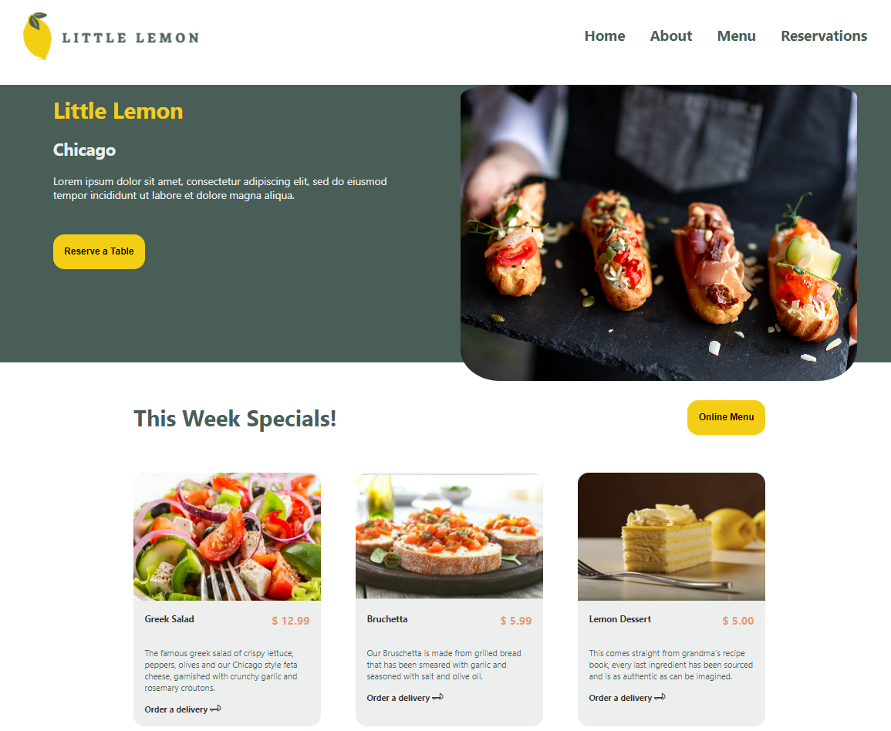
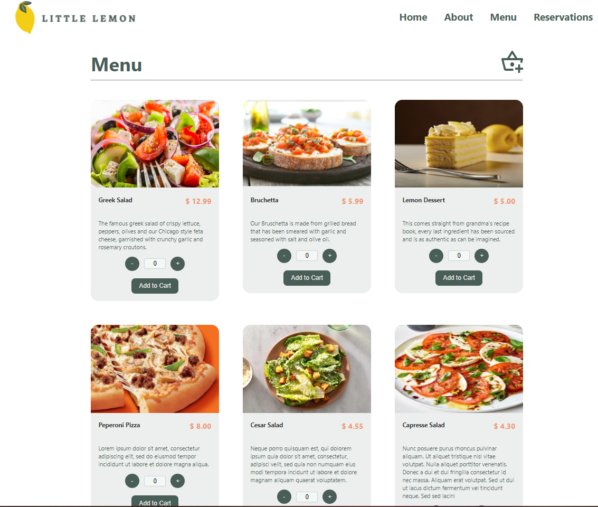
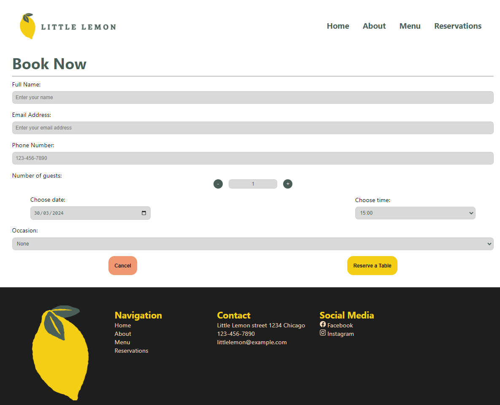

# LITTLE LEMON WEB APP

Small Restaurant WebPage to order and make reservations.

# Application Description
This application was created as part of the Front-End Developer Capstone Course within the FrontEnd Meta certification program. Its primary objective is to showcase the comprehensive knowledge acquired throughout the certification series, encompassing various essential aspects such as hooks, routers, styling, HTML, Context API, and API consumption.

Designed to simulate a restaurant's web interface, the application enables users to seamlessly interact with its features. Presently, users can effortlessly make and modify reservations. Furthermore, they can browse the restaurant's online menu and conveniently place orders through an integrated shopping cart feature.

# Application Description

## Available Scripts

In the project directory, you can run:

### `npm start`

Runs the app in the development mode.\
Open [http://localhost:3000](http://localhost:3000) to view it in your browser.

The page will reload when you make changes.\
You may also see any lint errors in the console.

### `npm test`

Launches the test runner in the interactive watch mode.\
See the section about [running tests](https://facebook.github.io/create-react-app/docs/running-tests) for more information.

### `npm run build`

Builds the app for production to the `build` folder.\
It correctly bundles React in production mode and optimizes the build for the best performance.

The build is minified and the filenames include the hashes.\
Your app is ready to be deployed!

See the section about [deployment](https://facebook.github.io/create-react-app/docs/deployment) for more information.

